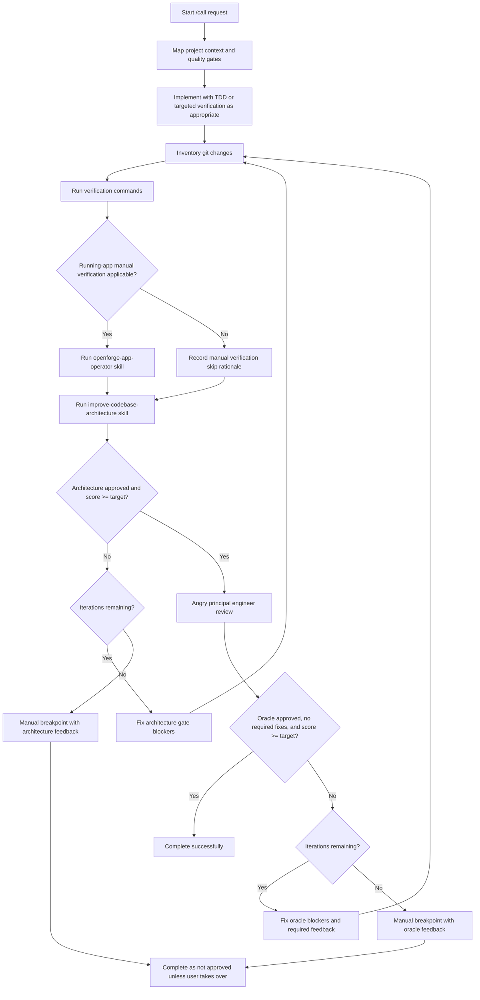

# Angry Oracle Code-Change Process Diagram

```mermaid
flowchart TD
    A[Start /call request] --> B[Map project context and quality gates]
    B --> C[Implement with TDD or targeted verification as appropriate]
    C --> D[Inventory git changes]
    D --> E[Run verification commands]
    E --> F{Running-app manual verification applicable?}
    F -- Yes --> G[Run openforge-app-operator skill]
    F -- No --> H[Record manual verification skip rationale]
    G --> I[Run improve-codebase-architecture skill]
    H --> I
    I --> J{Architecture approved and score >= target?}
    J -- No --> L{Iterations remaining?}
    L -- Yes --> M[Fix architecture gate blockers]
    M --> D
    L -- No --> N[Manual breakpoint with architecture feedback]
    J -- Yes --> P[Angry principal engineer review]
    P --> Q{Oracle approved, no required fixes, and score >= target?}
    Q -- Yes --> K[Complete successfully]
    Q -- No --> R{Iterations remaining?}
    R -- Yes --> S[Fix oracle blockers and required feedback]
    S --> D
    R -- No --> T[Manual breakpoint with oracle feedback]
    T --> O[Complete as not approved unless user takes over]
    N --> O
```
