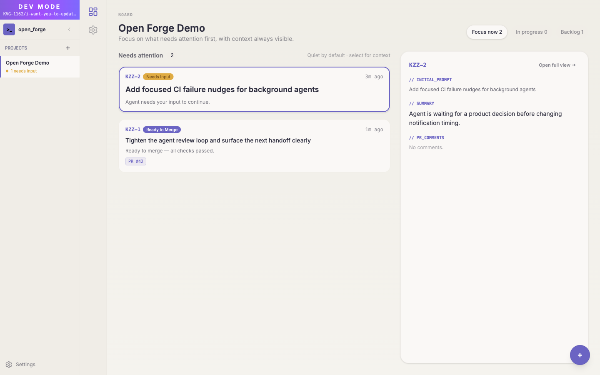
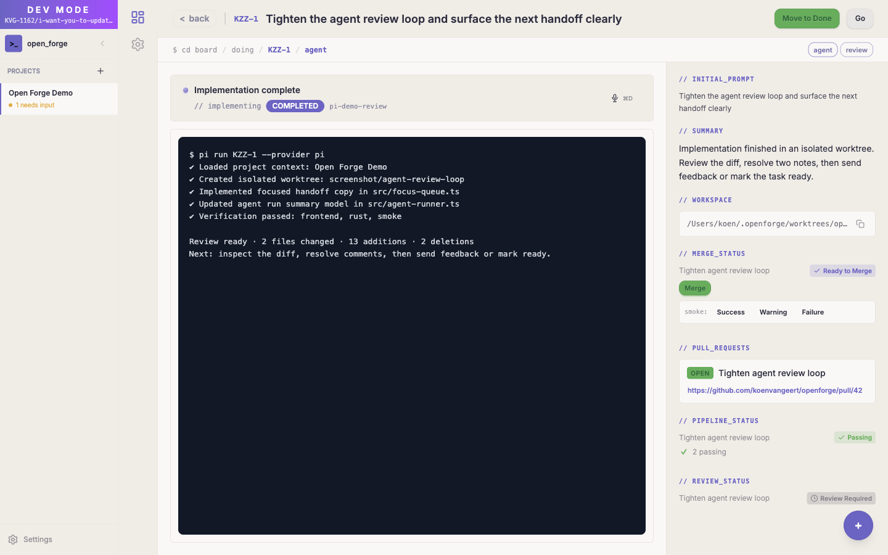
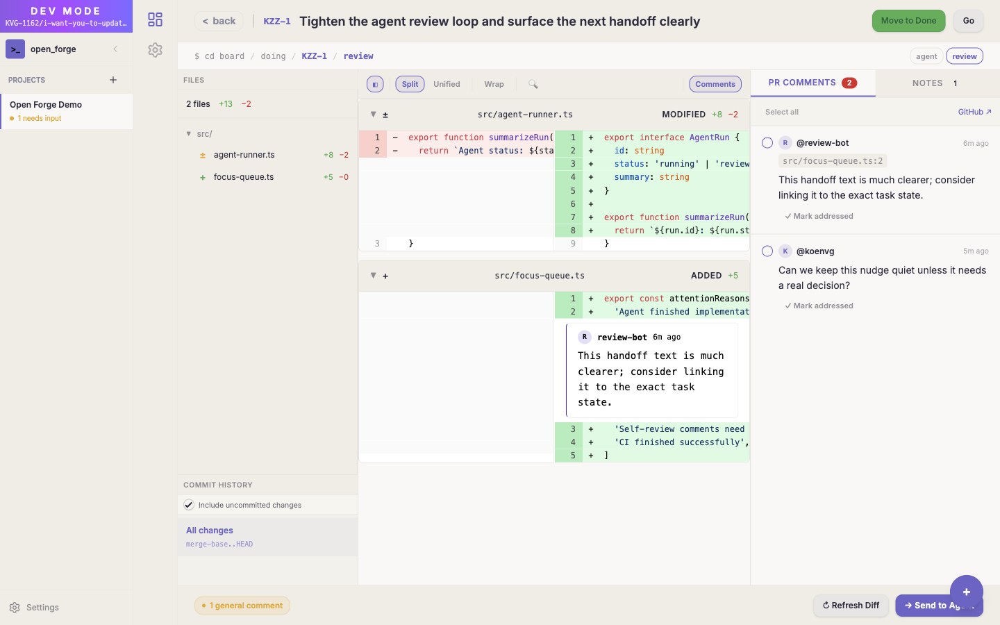

<p align="center">
  
</p>

<h1 align="center">Open Forge</h1>

<p align="center">
  A calm desktop command center for AI-assisted development. Turn a task into an isolated agent run, watch the terminal, review the diff, and decide what ships — without losing the thread.
</p>

<p align="center">
  <a href="#quick-install">Install</a> ·
  <a href="#why-open-forge-exists">Why it exists</a> ·
  <a href="#what-it-does-today">Features</a> ·
  <a href="#local-development">Development</a>
</p>

---



## Why Open Forge exists

AI coding agents are good at producing code, but the surrounding workflow still creates admin: writing tasks, choosing the right project, starting the agent, watching for handoffs, checking CI, reading diffs, giving feedback, and deciding whether the work is actually good.

Open Forge exists to put that loop in one focused place. It is not trying to replace engineering judgment or turn software work into a black box. It is a local-first operator console for people who want AI help while keeping ownership of the task, context, review, and final decision.

The product direction follows the same thinking Koen writes about on [koenvg.be](https://koenvg.be/): remove unnecessary friction, keep tools calm and understandable, and avoid outsourcing the judgment that keeps the “thinking muscle” sharp. The goal is speed with trust, not speed that creates a pile of work you no longer understand.

## Philosophy

- **Clarity first.** A good tool should make the next action obvious. Open Forge favors a focused board, explicit task state, and visible agent output over a noisy dashboard.
- **Human judgment stays central.** Agents can implement, summarize, and review, but the developer still owns the problem framing and the shipping decision.
- **Friction should be intentional.** Repeated admin belongs in the tool; important thinking, review, and trade-off calls should stay visible.
- **Local workflows should feel solid.** Worktrees, SQLite state, local credentials, terminals, and the Rust sidecar are designed so the app can coordinate real development work without sending your workflow through a hosted control plane.
- **Fast feedback beats clever ceremony.** Tasks, terminals, self-review, PR review, and CI status sit close together so you can tighten the loop quickly.

## What it does today

Open Forge is a macOS desktop app for running AI coding agents across one or more projects while keeping attention on the current actionable item.

| Area | What Open Forge provides |
|---|---|
| **Flow board** | Create, prioritize, search, and move tasks from a focused board with an always-visible detail pane and keyboard navigation. |
| **Agent runs** | Start Claude Code, OpenCode, or Pi-based agents per task. Each run gets an isolated git worktree and branch. |
| **Live terminals** | Watch embedded PTY output, use multiple shell tabs, and keep agent lifecycle state attached to the task. |
| **Self-review** | Inspect agent changes in a syntax-highlighted diff viewer, leave inline feedback, and send that feedback back into the loop. |
| **PR review** | Review GitHub pull requests assigned to you, browse diffs and comments, submit reviews, and keep CI/review status in sync. |
| **Project attention** | Track meaningful handoffs — blocked agents, review readiness, CI changes, and tasks that need a decision — without constant noise. |
| **Plugins and skills** | Extend the desktop surface with managed plugins and reusable agent skills. |
| **Voice input** | Dictate instructions with on-device Whisper transcription when speaking is faster than typing. |
| **OpenForge CLI** | Let agents and scripts read/update tasks through the local Open Forge bridge. |

## The workflow in pictures

| Board | Task detail |
|---|---|
|  |  |

| Self-review |
|---|
|  |

## Quick install

Install the latest prebuilt release (macOS, no build tools required):

```bash
curl -fsSL https://raw.githubusercontent.com/koenvangeert/openforge/main/scripts/install.sh | sh
```

To install a specific version:

```bash
OPENFORGE_VERSION=0.0.5 curl -fsSL https://raw.githubusercontent.com/koenvangeert/openforge/main/scripts/install.sh | sh
```

> **Note:** The app is unsigned. The install script automatically removes the macOS quarantine flag. If you downloaded the DMG manually, run:
> ```
> xattr -rd com.apple.quarantine /Applications/Open\ Forge.app
> ```

## Manual install (build from source)

If you prefer to build from source or want to run the latest unreleased changes:

**Prerequisites:** [Rust](https://rustup.rs/) (1.77+), [Node.js](https://nodejs.org/) (20+), [pnpm](https://pnpm.io/) (10+), and macOS with Xcode Command Line Tools.

```bash
git clone https://github.com/koenvangeert/openforge.git
cd openforge
pnpm install
pnpm electron:install
```

This builds a production release, copies `Open Forge.app` to `/Applications`, and removes the macOS quarantine flag. If an existing instance is running it will be closed automatically before the install.

## CLI

The installer creates an `openforge` CLI launcher at `~/.openforge/bin/openforge` and adds `~/.openforge/bin` to `~/.zshrc` if it is not already present. Open Forge also refreshes the launcher on app startup. Restart your shell or run `source ~/.zshrc`, then use:

```bash
openforge --help
openforge list-projects
openforge get-task --task-id T-123
openforge update-task --task-id T-123 --summary "Done"
```

The CLI talks to the local Open Forge HTTP bridge and is used by the auto-installed provider skills.

## Tech stack

- **Frontend** — Svelte 5, TypeScript, Tailwind CSS v4, daisyUI v5
- **Desktop shell** — Electron/Chromium main + sandboxed preload
- **Backend** — Rust sidecar, SQLite
- **AI agents** — Claude Code CLI, OpenCode, and Pi provider integration
- **Plugin platform** — OpenForge plugin SDK with built-in plugin workspace

## Prerequisites

- [Rust](https://rustup.rs/) (1.77+)
- [Node.js](https://nodejs.org/) (20+) and [pnpm](https://pnpm.io/) (10+)
- macOS with Xcode Command Line Tools (for Metal/Whisper support)
- At least one supported coding agent/provider, such as [Claude Code](https://docs.anthropic.com/en/docs/claude-code), [OpenCode](https://github.com/opencode-ai/opencode), or Pi

## Local development

```bash
# Install frontend dependencies
pnpm install

# Run the full Electron desktop app in dev mode
pnpm electron:dev

# Or run just the frontend dev server (no desktop shell)
pnpm dev
```

`pnpm electron:dev` starts Vite, builds the Rust sidecar, builds the Electron main/preload bundle, then launches Electron. Rust sidecar layout facts live in `openforge-backend-layout.json` and are resolved by `scripts/rust-sidecar-layout.mjs`. It shares Rust build artifacts through the checkout's Git common directory by setting `CARGO_TARGET_DIR` to `.cargo-target` beside the primary `.git` directory. Set `CARGO_TARGET_DIR` yourself to override it.

By default, `pnpm electron:dev` uses temporary Electron `userData` and a worktree-local sidecar app-data directory recorded in `.openforge-dev/electron-dev-runtime.json`. If your normal Open Forge app-data directory already contains `openforge_dev.db`, the dev launcher snapshots that development database into `.openforge-dev/sidecar-app-data` on first use, then reuses that worktree-local database across later launches. To force a fresh empty dev database for a run, disable auto-seeding:

```bash
OPENFORGE_ELECTRON_DEV_DISABLE_AUTO_SEED=1 pnpm electron:dev
```

To reuse a directory directly, set `OPENFORGE_APP_DATA_DIR=/path/to/app-data` only when no other Open Forge build is using that database. To seed from a non-default development data directory or a specific development backup file:

```bash
OPENFORGE_ELECTRON_DEV_SEED_APP_DATA_DIR="$HOME/Library/Application Support/com.opencode.openforge" pnpm electron:dev
# or seed from a specific development backup/database file:
OPENFORGE_ELECTRON_DEV_SEED_DB_PATH="/path/to/openforge_dev.db" pnpm electron:dev
```

Seeding only copies the development database (`openforge_dev.db`) into the worktree-local dev sidecar directory as `openforge_dev.db`; production databases (`openforge.db`) are never copied or accepted. Companion SQLite `-wal`/`-shm` files are copied if present. The source database is not shared live, and the worktree-local database is not cleaned up when dev exits. Explicit seed settings apply before the worktree DB exists; to reseed or clean up that per-worktree state, stop `pnpm electron:dev` and delete `.openforge-dev/`. For the safest snapshot, quit other dev Open Forge builds before seeding from their app-data directory.

## Testing

```bash
# Frontend tests
pnpm test

# Focus a Vitest run on one file or pattern (no `--` separator)
pnpm test src/components/ProjectFileTree.test.ts
# or
pnpm exec vitest run src/components/ProjectFileTree.test.ts

# Rust tests
cd "$(node scripts/rust-sidecar-layout.mjs backend-crate-root)" && cargo test

# Rust-only backend validation (from the backend crate root)
cargo check
cargo build
cargo clippy
```

Rust validation builds the backend sidecar and does not require a prebuilt `dist/` frontend bundle. Release packaging is Electron-owned; use `pnpm electron:install` for a full local app build/install.

## Building

```bash
# Build renderer, Electron main/preload, plugins, and Rust sidecar into a macOS app bundle
pnpm electron:package

# Build and install the Electron app into /Applications
pnpm electron:install
```

`pnpm electron:install` builds the Svelte renderer, Electron main/preload files, and the Rust sidecar, packages them into the Electron app path resolved from `openforge-backend-layout.json` (currently `src-tauri/target/release/bundle/electron/macos/Open Forge.app`), then copies the app to `/Applications`.

## First-run setup

1. Launch the app — the project setup dialog appears automatically
2. Go to **Settings > Global** to configure your AI provider and GitHub token
3. Go to **Settings > Project** to set the GitHub repo
4. Create a task (`Cmd+T`), right-click it, and choose **Start Task**
